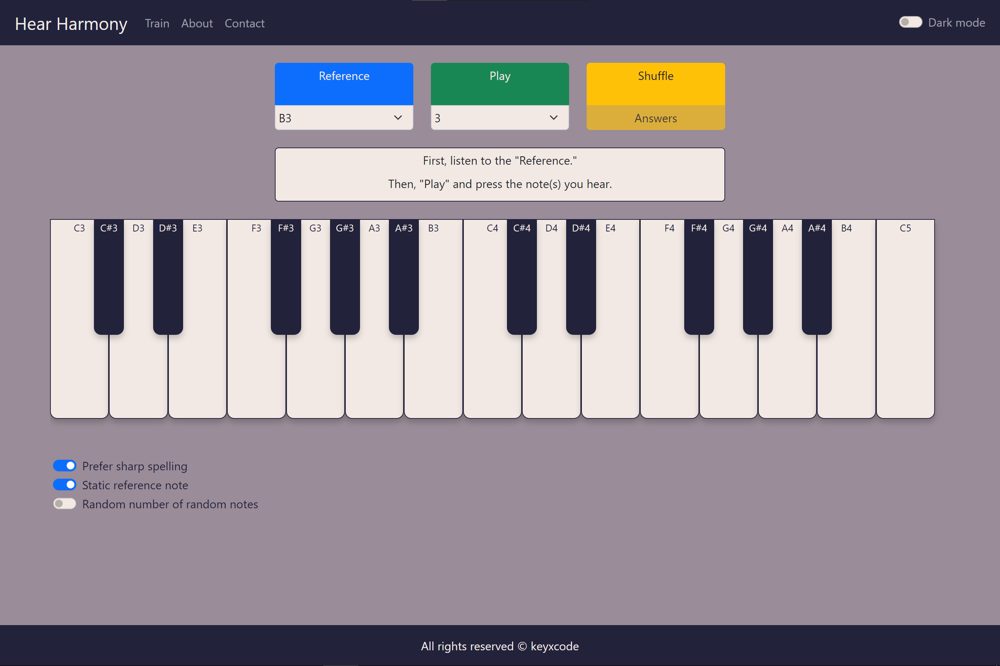
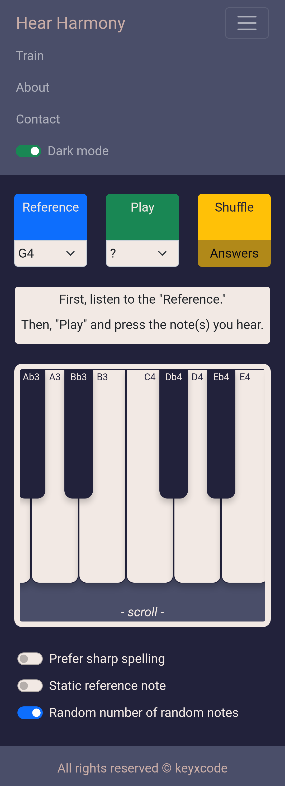

# Hear Harmony
### Video Demo
<iframe width="560" height="315" src="https://www.youtube.com/embed/YyhchssUR-s" title="YouTube video player" frameborder="0" allow="accelerometer; autoplay; clipboard-write; encrypted-media; gyroscope; picture-in-picture" allowfullscreen></iframe>

---

### Description

[**Hear Harmony**](https://keyxcode.github.io/hear-harmony/) was developed to help musicians improve their *relative pitch*. 

*Relative pitch* is the ability to identify one or many given musical notes by comparing it to a reference note. This can be developed through ear training.

---

### Screenshots

*Desktop UI - Light Mode*

*Mobile UI - Dark Mode*

---

### How to use

On the ***Train*** page, press *"Reference"*, carefully listen to it, then press *"Play"*, which plays from one to five random notes, depending on the number of notes you select. Next, play your guesses on the on-screen piano until you get all of them right.

After you get the answer right, press *"Shuffle"* to get a new set of random notes. If the challenge is too difficult, you could press *"Answers"*, which reveals the notes to you.

The *"Prefer sharp spelling"* switch toggles between flat and sharp spelling for the on-screen note names.

The *"Static reference note"* switch determines whether or not the reference note changes when you *"Shuffle"*. This might be useful when you want to train your relative pitch against a specific note, for example C3.

If you are looking for an extra challenge, try turning on the *"Random number of random notes"* switch. This will hide the number of random notes from you, and will also change this number each time you *"Shuffle"*. 

---
### Pro-tip

You could play the on-screen piano using your computer keyboard. The lower octave starts with "Z" as C3 and the upper octave starts with "Q" as C4. See if you could figure out how they map to the rest of the piano!

---

### Methodology

**Hear Harmony** is uniqe in that it does not restrict the random notes to only conventional combinations, such as major, minor, diminished, etc. I believe that true relative pitch means being able to hear any strange note combination. Besides, this will be especially helpful for musicians who wish to enrich their harmonic vocabulary. Sometimes, the chord you can not name is the one you wish you could use.

Happy ear training! 🎹

