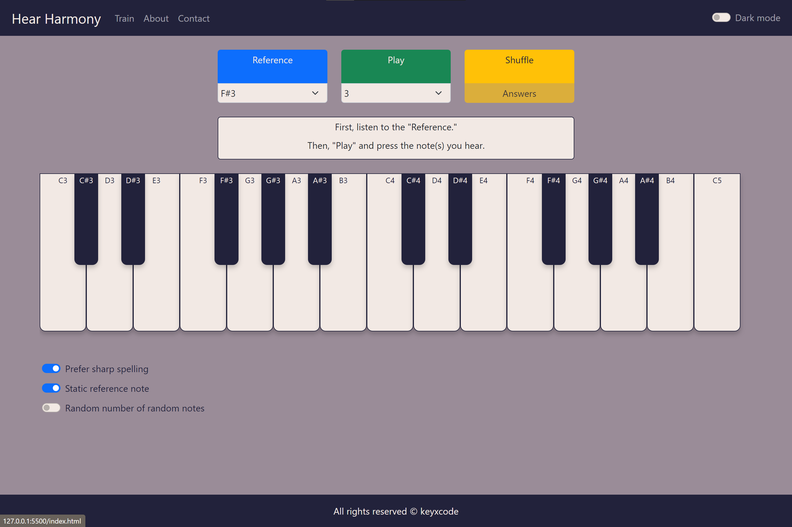

# Hear Harmony
### Video Demo: https://youtu.be/YyhchssUR-s

---

### Description

[**Hear Harmony**](https://keyxcode.github.io/hear-harmony/) was developed to help musicians improve their *relative pitch*. 

*Relative pitch* is the ability to identify one or many given musical notes by comparing it to a reference note. This can be developed through ear training.

---

### Screenshots

*Desktop UI - Light Mode*

*Mobile UI - Dark Mode*

---

### Technical Details

This website was implemented using HTML, CSS with the Boostrap framework, and JavaScript. A lot of work was put into assuring both the desktop and mobile experience are as flawless as possible, especially when it comes to interacting with the on-screen piano. In the end, the scrolling piano interface was chosen for mobile because it offers the most compact, easy-to-use, as well as aesthetically pleasing design.

When it comes to the JavaScript, two challenges I faced were how to organize the game logic, and how to implement the audio engine.

At the beginning, there was barely any organization to the code, and everything was in the global scope. As the program grew, I soon found out that it was to difficult to navigate and manage as there was too much dependency between different functions and variables. After some research, I found a good way to solve this is to utilize an MVC model, putting components in their appropriate namespace Model, View, and Controller. The end result is still not perfect, but is much easier to navigate than what it originally was.

The other challenge was implementing the audio engine. At the beginning, I used the HTML `<audio>` tag to play my piano samples. However, I soon found out that it did not offer the best playback for short samples, so I ended up using the Web Audio API instead. Another thing I tried to implement is to emulate the piano action to be as realistic as possible. This means that if you press a note quickly, it will give you a short release, while holding a note for a long time will lengthen the tail. Many piano web apps I came across default to either one of those two behaviors: all short notes, or all long notes for simplicity.

I considered building a backend for users to log in to this app, but after further consideration, decided that it was not necessary for the purpose of this site, and would only add unwanted complexities for both me and the users. In the end, the only backend I use is a Formspree service to point the contact form to.

---

### How To Use

On the ***Train*** page, press *"Reference"*, carefully listen to it, then press *"Play"*, which plays from one to five random notes, depending on the number of notes you select. Next, play your guesses on the on-screen piano until you get all of them right.

After you get the answer right, press *"Shuffle"* to get a new set of random notes. If the challenge is too difficult, you could press *"Answers"*, which reveals the notes to you.

The *"Prefer sharp spelling"* switch toggles between flat and sharp spelling for the on-screen note names.

The *"Static reference note"* switch determines whether or not the reference note changes when you *"Shuffle"*. This might be useful when you want to train your relative pitch against a specific note, for example C3.

If you are looking for an extra challenge, try turning on the *"Random number of random notes"* switch. This will hide the number of random notes from you, and will also change this number each time you *"Shuffle"*. The purpose of this switch is to help you get used to distinguishing the texture of 2-note chords, 3-note chords, 4-note chords, etc. without knowing this number in advance.

---

### Pro-tip

You could play the on-screen piano using your computer keyboard. The lower octave starts with "Z" as C3 and the upper octave starts with "Q" as C4. See if you could figure out how they map to the rest of the piano!

---

### Methodology

**Hear Harmony** is unique in that it does not restrict the random notes to only conventional combinations, such as major, minor, diminished, etc. I believe that true relative pitch means being able to hear any strange note combination. Besides, this will be especially helpful for musicians who wish to enrich their harmonic vocabulary. Sometimes, the chord you can not name is the one you wish you could use.

Happy ear training! 🎹